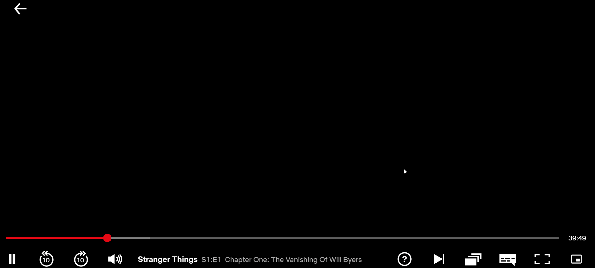

# Picture-in-picture control button on Netflix movie player next to the full screen button
The extension put a new picture-in-picture control button to the video control bar. On click to this button it opens the video picture in picture mode.

## Description

### Screenshots

### How it works:

#### In action

# Tasks & Imporvements

# Needs fix

## v.0.1.0
- [X] Show PIP control button on the control row next to the full screen
- [X] Transform it on mouse hover and leave
- [X] Open video tag in PIP on click
