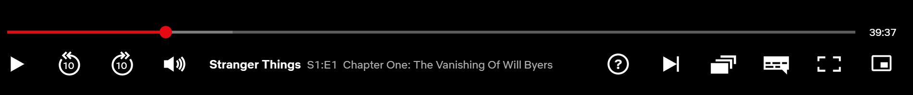

# Picture-in-picture control button on Netflix movie player next to the full screen button 
 

This extension adds a new picture-in-picture control button to the video control bar. 

On click it opens the video in a floating window (always on top of other windows).

** Disclaimer ** Netflix is registered trademarks, this extension is not affiliated with Netflix.

## Description
I decided to make this extension because I missed this control button so much. After I started the work I had to realize there is a solution already by the Google's official PIP extension. [Picture-in-picture extension (by Google):](https://chrome.google.com/webstore/detail/picture-in-picture-extens/hkgfoiooedgoejojocmhlaklaeopbecg)

But! I still wanted that control button to be there on the Netflix's video player control bar so I did not give up the extra work.

# Tasks & Imporvements

## v.0.0.1
- [X] Show PIP control button on the control row next to the full screen
- [X] Transform it on mouse hover and leave
- [X] Open video tag in PIP on click
- [X] Detect episode change
